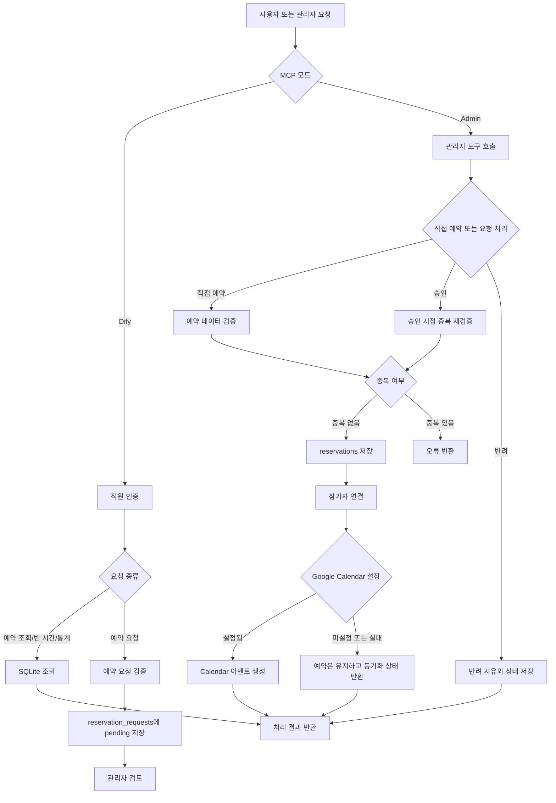

# Meeting Room System

MCP(Model Context Protocol) 기반의 회의실 예약 관리 서버입니다. 직원 인증, 회의실 예약 및 조회, 예약 요청 승인 프로세스, 예약 가능 시간 검색, 통계 조회를 제공하며 Google Calendar와 선택적으로 연동할 수 있습니다.

## 목차

- [개요](#개요)
- [전체적인 기능](#전체적인-기능)
- [플로우차트](#플로우차트)
- [실행법](#실행법)
- [세부 기능](#세부-기능)
- [영상](#영상)
- [프로젝트 구조](#프로젝트-구조)
- [운영 시 참고사항](#운영-시-참고사항)

## 개요

회의실 예약 업무를 MCP 도구로 표준화해 AI 에이전트 또는 MCP 클라이언트에서 사용할 수 있도록 만든 백엔드 시스템입니다.

- **관리자 모드**: MCP Inspector 등에서 직접 예약을 관리하는 `stdio` 서버
- **Dify 모드**: Dify 에이전트에 연결할 수 있는 `SSE` 서버
- **저장소**: 별도 DB 서버 없이 사용할 수 있는 SQLite
- **외부 연동**: 서비스 계정 기반 Google Calendar 이벤트 생성

예약 시간은 `YYYY-MM-DD HH:MM` 형식을 사용하며, 예약 카테고리는 `회의`, `접객`, `면접`, `자유` 중 하나입니다.

## 전체적인 기능

### 직원 및 예약 관리

- 이메일 완전 일치 기반 직원 인증
- 날짜, 기간, 카테고리별 예약 조회
- 예약 생성 시 필수값, 날짜 형식, 종료 시간, 시간 중복 검증
- 예약 참가자 연결 및 직원별 참여 예약 조회

### 사용자 편의 기능

- 지정한 날짜와 시간 조건에 맞는 빈 시간대 검색
- 기간 및 카테고리별 예약 통계 제공
- 일반 직원의 예약 요청 등록

### 관리자 승인 기능

- 대기 중인 예약 요청 목록 조회
- 예약 요청 승인 또는 반려
- 승인 시 실제 예약 생성, 참가자 연결, Google Calendar 동기화
- 승인 시점의 시간 중복 재검증

## 플로우차트



## 실행법

### 1. 사전 요구사항

- Windows PowerShell
- Python 3.10 이상 권장
- Dify 연동 시 MCP를 지원하는 Dify 환경
- Google Calendar 연동 시 Google Cloud 서비스 계정과 Calendar API 설정

### 2. 가상환경 준비

프로젝트 루트에서 실행합니다.

```powershell
python -m venv .venv
.\.venv\Scripts\Activate.ps1
python -m pip install --upgrade pip
pip install fastmcp google-api-python-client google-auth
```

현재 프로젝트에 포함된 `mcp` 가상환경을 사용하는 경우에는 새 환경을 만들지 않고 다음처럼 활성화할 수 있습니다.

```powershell
.\mcp\Scripts\Activate.ps1
```

### 3. 환경변수 설정

#### 기본 설정

```powershell
$env:MCP_MODE = "dify"
$env:PORT = "8001"
```

`MCP_MODE`는 `admin` 또는 `dify`로 설정합니다.

| 변수                          | 기본값                     | 설명                              |
| ----------------------------- | -------------------------- | --------------------------------- |
| `MCP_MODE`                    | `admin`                    | `admin`: stdio, `dify`: SSE       |
| `PORT`                        | `8001`                     | Dify 모드의 SSE 포트              |
| `MEETING_ROOM_DB_PATH`        | `database/meeting_room.db` | SQLite 파일 경로                  |
| `GOOGLE_SERVICE_ACCOUNT_FILE` | 없음                       | Google 서비스 계정 JSON 파일 경로 |
| `GOOGLE_CALENDAR_ID`          | 없음                       | 동기화 대상 Google Calendar ID    |

### 4. 서버 실행

#### Dify 연동 모드

```powershell
$env:MCP_MODE = "dify"
$env:PORT = "8001"
python .\mcp_server.py
```

서버는 `http://localhost:8001`에서 SSE transport로 실행됩니다. 실제 Dify 연결 주소는 사용하는 Dify/MCP 커넥터의 SSE 엔드포인트 규칙에 맞춰 설정합니다.

#### 관리자 모드

```powershell
$env:MCP_MODE = "admin"
python .\mcp_server.py
```

관리자 모드는 `stdio` transport를 사용합니다. MCP Inspector로 확인하려면 별도 PowerShell 창에서 다음 명령을 실행합니다.

```powershell
npx @modelcontextprotocol/inspector
```

#### 제공된 실행 스크립트 사용

`run_mcp.ps1`는 Dify 모드, 포트, Google Calendar 관련 환경변수를 설정한 뒤 서버를 실행합니다.

```powershell
Set-ExecutionPolicy -ExecutionPolicy Bypass -Scope Process
.\run_mcp.ps1
```

### 5. 데이터베이스 초기화

서버 시작 시 `database/meeting_room.db`가 없으면 `database/database_setting.sql`을 이용해 자동 생성합니다. 별도의 마이그레이션 명령은 필요하지 않습니다.

## 세부 기능

### MCP 도구

| 도구                              | 사용 모드    | 설명                                                    |
| --------------------------------- | ------------ | ------------------------------------------------------- |
| `authenticate_employee`           | Dify         | 이메일로 직원 인증                                      |
| `list_reservations_with_date`     | Admin / Dify | 특정 날짜, 기간, 카테고리의 예약 조회                   |
| `add_reservation`                 | Admin / Dify | 중복 검증 후 예약 직접 생성                             |
| `find_available_slots`            | Dify         | 업무 시간 내 예약 가능한 시간대 검색                    |
| `get_statistics`                  | Dify         | 카테고리, 요일, 시간, 일자별 통계와 평균 이용 시간 조회 |
| `list_reservations_with_employee` | Admin / Dify | 직원 이메일 기준 참여 예약 조회                         |
| `create_reservation_request`      | Dify         | 일반 직원 예약 요청을 `pending` 상태로 저장             |
| `list_reservation_requests`       | Admin / Dify | 예약 요청을 상태별로 조회                               |
| `approve_reservation_request`     | Admin / Dify | 요청 승인 및 실제 예약 생성                             |
| `reject_reservation_request`      | Admin / Dify | 요청 반려 및 사유 저장                                  |

### 예약 요청 상태

1. 일반 직원이 예약 요청을 등록하면 실제 예약이 아니라 `pending` 요청으로 저장됩니다.
2. 관리자가 요청을 조회하고 승인하면 실제 예약과 참가자 정보가 생성됩니다.
3. 승인 시점에 시간 중복을 다시 검사합니다. 중복이면 요청은 `pending` 상태로 유지됩니다.
4. 반려하면 실제 예약은 생성되지 않고 `rejected` 상태와 반려 사유가 저장됩니다.

### Google Calendar 동기화

Google Calendar 설정이 완료된 경우 직접 예약 또는 예약 요청 승인 시 이벤트를 생성합니다. Calendar 설정이 없거나 동기화에 실패해도 SQLite 예약 데이터는 유지되며, 응답의 `calendar_sync` 값으로 결과를 확인할 수 있습니다.

- `success`: 이벤트 생성 성공
- `not_configured`: Calendar 환경변수 미설정
- `failed`: 외부 API 호출 실패

## 영상

서비스 사용 흐름과 실행 화면을 아래 위치에 추가할 예정입니다.

> **Demo 영상**: `docs/demo.mp4` 또는 저장소에 업로드한 YouTube 링크를 여기에 삽입하세요.
>
> 예시: `[Demo 영상 보기](https://youtu.be/VIDEO_ID)`

## 프로젝트 구조

```text
meeting_room_system/
├─ mcp_server.py                 # FastMCP 서버와 도구 등록
├─ run_mcp.ps1                   # Dify 모드 실행 스크립트
├─ calendar_credentials.json     # Google 서비스 계정 인증 파일
├─ database/
│  └─ database_setting.sql       # SQLite 초기 스키마
├─ services/                     # 인증, 예약, 요청, 조회, 통계 로직
├─ utils/                        # DB, 날짜 형식, Google Calendar 유틸리티
└─ readme.md
```

## 운영 시 참고사항

- `calendar_credentials.json`과 같은 인증 파일은 공개 저장소에 커밋하지 마세요. 배포 환경의 비밀 저장소 또는 환경변수로 관리하는 것을 권장합니다.
- `MEETING_ROOM_DB_PATH`를 지정하지 않으면 서버 디렉터리 아래 `database/meeting_room.db`에 데이터가 저장됩니다.
- 예약 시간은 시작 시간이 종료 시간보다 빠르고, 기존 예약과 겹치지 않아야 합니다.
- 현재 예약 삭제 및 수정 함수는 구현되어 있지 않으므로, 운영 배포 전 필요한 관리자 기능인지 확인하세요.
- Dify에 연결하기 전 로컬에서 MCP Inspector로 각 도구의 입력과 응답을 점검하는 것을 권장합니다.

## 라이선스

라이선스가 결정되면 이 섹션에 프로젝트 라이선스를 추가하세요.

cd C:\경로\회의실폴더 $env:MCP_MODE="dify" $env:PORT="8001" python mcp_server.py

Set-ExecutionPolicy -ExecutionPolicy Bypass -Scope Process

npx @modelcontextprotocol/inspector
